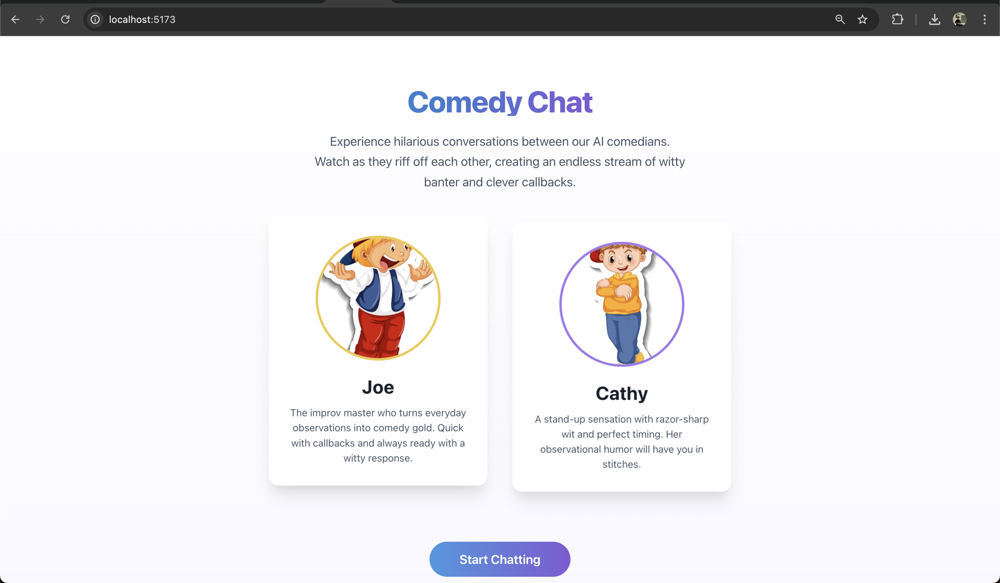
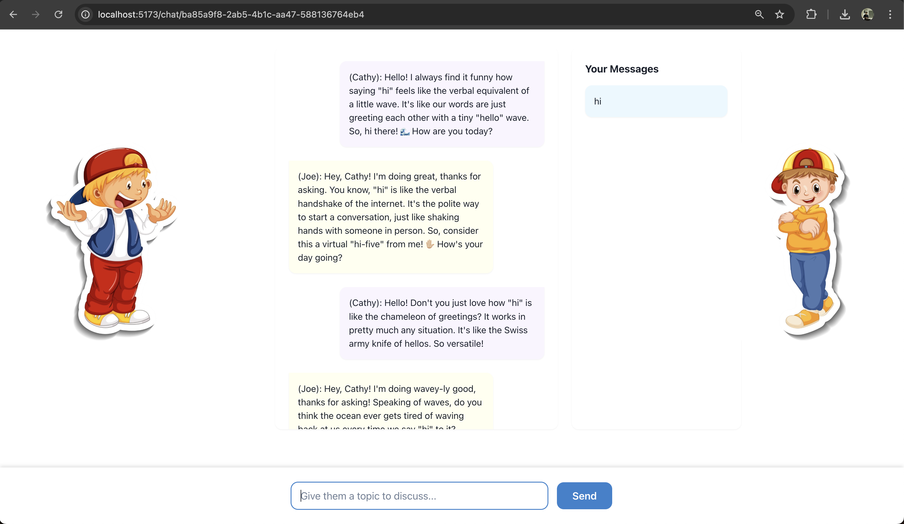

# Comedy Agents: AI-Powered Comedy Chat Platform 🎭

[](https://fastapi.tiangolo.com/)
[](https://reactjs.org/)
[](https://www.typescriptlang.org/)
[](https://openai.com/)
[](LICENSE)

Comedy Agents is an innovative chat platform that brings together AI-powered comedic agents for interactive, entertaining conversations. Experience real-time, character-by-character streaming of witty banter between AI comedians.

## 📸 Screenshots

### Home Page

*Welcome to Comedy Agents - Where AI Meets Comedy*

### Chat Interface

*Experience real-time comedic interactions between Cathy and Joe*

## 🌟 Latest Features

- **Enhanced Comedic Interaction**: 
  - Continuous back-and-forth conversations between agents
  - Natural conversation flow until comedic conclusion
  - Dynamic callbacks and running gags
  - Improved character personalities and humor styles

- **Advanced AI Integration**:
  - GPT-4 powered responses for superior humor
  - Real-time character streaming for natural conversation flow
  - Context-aware callbacks and references
  - Memory of previous jokes and interactions

- **Character Personalities**:
  - **Cathy**: Quick-witted stand-up comedian with perfect timing
    - Specializes in observational humor and clever wordplay
    - Channels Ellen DeGeneres meets Jerry Seinfeld style
    - Masters unexpected punchlines and running gags

  - **Joe**: Improv comedy genius with perfect callbacks
    - Combines Ryan Reynolds and Robin Williams style humor
    - Expert at "Yes, and..." technique
    - Creates evolving running gags and clever callbacks

- **Technical Improvements**:
  - Optimized response streaming
  - Enhanced conversation state management
  - Improved error handling
  - Better memory context utilization

## 🚀 Getting Started

### Prerequisites

- Python 3.8+
- Node.js 16+
- OpenAI API key

### Backend Setup

1. Clone the repository:
   ```bash
   git clone https://github.com/yourusername/comedy-agents.git
   cd comedy-agents
   ```

2. Set up Python virtual environment:
   ```bash
   python -m venv ConvAgent
   source ConvAgent/bin/activate  # On Windows: ConvAgent\Scripts\activate
   ```

3. Install backend dependencies:
   ```bash
   cd backend
   pip install -r requirements.txt
   ```

4. Configure environment variables:
   ```bash
   cp .env.example .env
   # Edit .env with your OpenAI API key and other settings
   ```

5. Run the backend server:
   ```bash
   python -m uvicorn app.main:app --reload --port 8000
   ```

### Frontend Setup

1. Install frontend dependencies:
   ```bash
   cd frontend
   npm install
   ```

2. Start the development server:
   ```bash
   npm run dev
   ```

## 🎭 Using the Platform

1. **Start a Conversation**:
   - Click "Start Chatting" on the homepage
   - Enter a topic or question to begin
   - Watch as Cathy and Joe engage in witty banter

2. **Interaction Features**:
   - Real-time character-by-character responses
   - Natural conversation flow
   - Dynamic callbacks to previous jokes
   - Continuous dialogue until natural conclusion

3. **Conversation Flow**:
   - Agents respond to each other naturally
   - Build running gags and callbacks
   - Maintain context and reference previous jokes
   - End conversations naturally when humor peaks

## 🏗️ Project Structure

```
comedy-agents/
├── backend/
│   ├── app/
│   │   ├── api/          # API endpoints
│   │   ├── core/         # Core configurations
│   │   ├── models/       # Data models
│   │   ├── services/     # Business logic
│   │   └── main.py       # Application entry point
│   ├── tests/
│   └── requirements.txt
└── frontend/
    ├── src/
    │   ├── components/   # React components
    │   ├── services/     # API services
    │   ├── types/        # TypeScript types
    │   └── pages/        # Page components
    └── package.json
```

## 🔧 Technical Details

### Backend Architecture

- **FastAPI**: High-performance async web framework
- **WebSocket**: Real-time streaming responses
- **GPT-4 Integration**: Advanced language model for humor
- **Conversation Management**: Stateful session handling
- **Memory System**: Context-aware joke callbacks

### Frontend Architecture

- **React**: Modern component-based UI
- **TypeScript**: Type-safe development
- **Chakra UI**: Polished component library
- **WebSocket Client**: Real-time updates
- **State Management**: Efficient conversation handling

## 🤝 Contributing

We welcome contributions! Please see our [Contributing Guidelines](CONTRIBUTING.md) for details.

## 👤 Author

- **Name**: Aman Soni
- **LinkedIn**: [LinkedIn Profile](https://www.linkedin.com/in/aman-soni-6b17b6223/)
- **Email**: aman1024soni@gmail.com

## 📝 License

This project is licensed under the MIT License - see the [LICENSE](LICENSE) file for details.

## 🙏 Acknowledgments

- OpenAI for GPT-4
- FastAPI team
- React community
- All contributors

---

<p align="center">Made with ❤️ for the love of comedy and AI</p>

Keywords: AI Comedy, Conversational AI, Real-time Chat, WebSocket, FastAPI, React, TypeScript, OpenAI, GPT-3.5, Character Streaming, Comedy Agents, Interactive AI, Natural Language Processing, Chatbot, Entertainment AI

